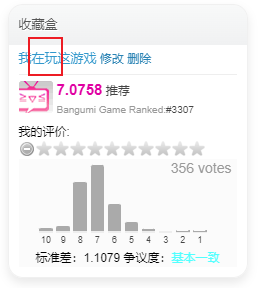
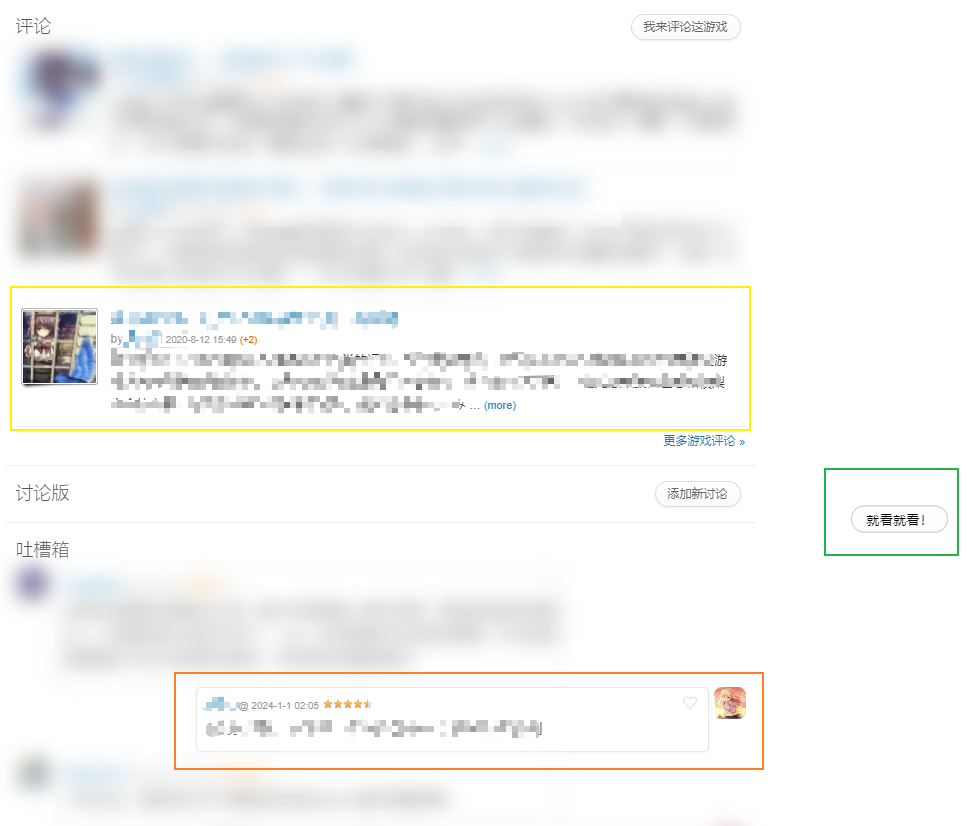

# bangumi-uncover-after-collect脚本说明

功能：当游戏类型的收藏条目设置为“在玩”（动画类型的收藏条目对应为“在看”，下略）后，
页面中的评论、讨论版和吐槽箱中的内容将会模糊化处理。

在鼠标点击相应的区块后，模糊化效果将会消失，显示原本的内容，
如图中的黄色方框和橙色方框（打了马赛克比模糊处理还糊，
这里露出一些不太敏感的信息作为清晰度对比参考）。

并且，没有信息的板块也不会被过度处理，如图中的讨论版。

此外，还右侧还有一个按钮，点击后页面中所有的模糊化效果都会消失。
再次点击后，页面中所有的模糊化效果都会重新出现。

效果展示：

